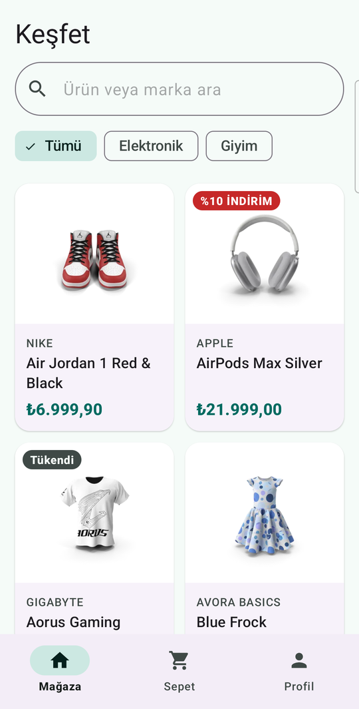
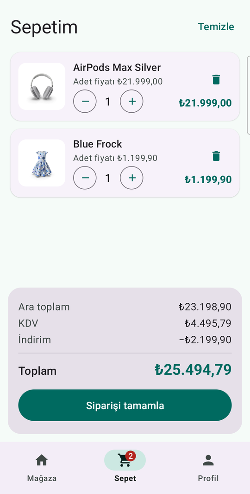
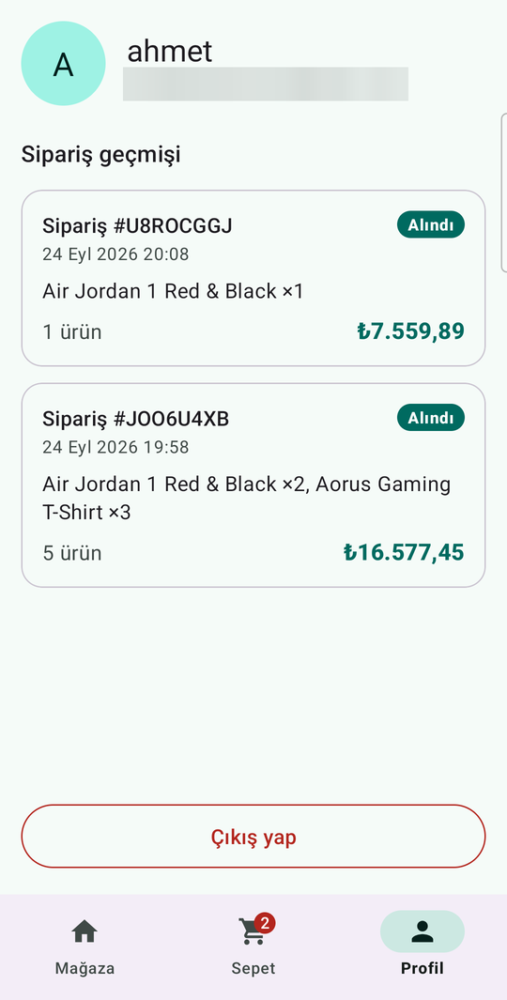
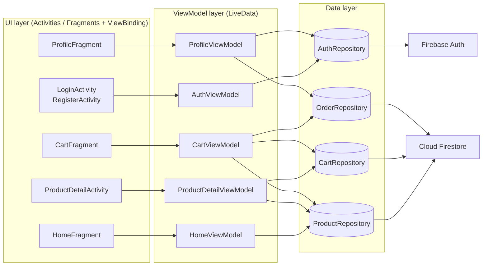

# Avora: Android E-Commerce App

[](https://github.com/insidethematrix/MyEcommerceApp/actions/workflows/android.yml)


Avora is a native Android shopping app written in **Java**. It uses an **MVVM + Repository**
architecture on top of **Firebase Authentication** and **Cloud Firestore**. Users can browse a
live product catalog, search and filter it, keep a cart that syncs in real time across devices,
and place orders through an atomic Firestore transaction that checks stock.

## Screenshots

| Catalog | Product | Cart | Order history |
|:---:|:---:|:---:|:---:|
|  |  |  |  |

## Features

- **Authentication**: email/password sign-up and login with Firebase Auth, input validation, and a persistent session (no login screen on relaunch)
- **Live catalog**: products stream from Firestore. Price or stock changes appear instantly without a refresh
- **Search and filters**: case-insensitive search by name or brand, combined with category chips
- **Product details**: category-specific attributes (warranty for electronics, size and color for clothing), discount and out-of-stock badges
- **Persistent cart**: stored per user in Firestore. It survives restarts and syncs between devices, and a badge on the bottom navigation shows the item count
- **Transactional checkout**: one Firestore transaction verifies stock, decrements it, writes the order and empties the cart. Either all of it happens or none of it does
- **Order history**: past orders on the profile screen, newest first
- **Security rules**: users can only access their own cart and orders, orders are append-only, and shoppers can only *decrease* stock
- **Material 3 UI**: light and dark theme, edge-to-edge, loading, empty and error states on every screen
- **Localization**: English and Turkish, with prices formatted as Turkish Lira (`₺25.000,00`)

## Architecture



- **Views** only render state and forward user actions. They hold no business logic.
- **ViewModels** expose `LiveData<Resource<T>>` (loading / success / error) and survive configuration changes. One-off UI messages use an `Event` wrapper, so a toast is not shown again after a rotation.
- **Repositories** are interfaces (`ProductRepository`, `CartRepository`, …) with Firestore implementations. ViewModels depend only on the interfaces, which is what makes them unit-testable with in-memory fakes.
- **Dependency injection** is manual: `AppContainer` builds the singletons once and `ViewModelFactory` wires them into ViewModels.

```
com.example.myecommerceapp
├── data
│   ├── model        Product, Electronics, Clothing, Discountable, CartItem, ShoppingCart, Order, ProductFactory
│   └── repository   *Repository interfaces + Firebase/Firestore implementations
├── ui
│   ├── auth         LoginActivity, RegisterActivity, AuthViewModel
│   ├── home         HomeFragment, ProductAdapter, ProductFilter, HomeViewModel
│   ├── detail       ProductDetailActivity, ProductDetailViewModel
│   ├── cart         CartFragment, CartAdapter, CartViewModel
│   └── profile      ProfileFragment, OrderAdapter, ProfileViewModel
├── util             Resource, Event, UiMessage, FirestoreQueryLiveData, PriceFormatter, Validators
├── AppContainer / ViewModelFactory / AvoraApp
└── MainActivity     Bottom navigation host
```

## Object-oriented design

The product model was built to practice the core OOP principles in a real scenario:

1. **Encapsulation**: model fields are `private final` and exposed through getters, so products and cart lines are immutable.
2. **Inheritance**: `Electronics` and `Clothing` extend the abstract `Product` and reuse its shared fields and logic.
3. **Polymorphism**: `ShoppingCart` works with a list of `Product`s, and each one applies its own tax rate (`Electronics` 20%, `Clothing` 8%).
4. **Interfaces**: `Discountable` gives discounts only to the categories that implement it (currently electronics, 10%).

## Design decisions

**Polymorphic products in Firestore.** `Product` is abstract. `Electronics` (20% VAT, implements
`Discountable` for 10% off) and `Clothing` (8% VAT) override its behavior. Firestore's
`toObject()` cannot instantiate abstract types, so every document stores a `category`
discriminator and `ProductFactory` builds the right subclass. A malformed document is skipped
and logged instead of breaking the whole catalog.

**`BigDecimal` for money.** `0.1 + 0.2 != 0.3` in `double`. All prices, taxes and totals use
`BigDecimal` and are rounded half-up to 2 decimal places (kuruş). The pricing rules live in
`ShoppingCart`, a plain Java class with no Android dependencies, so they are covered by fast JVM tests.

**Atomic checkout.** `FirestoreOrderRepository.placeOrder()` runs a transaction that reads every
product's current stock, aborts with `OutOfStockException` if any line exceeds it, and otherwise
decrements stock, writes the order and deletes the cart lines, all in one commit. Two users
buying the last item at the same time cannot both succeed. The order stores a snapshot of
names and unit prices, so later price changes don't rewrite history.

**Lifecycle-aware realtime listeners.** `FirestoreQueryLiveData` attaches a Firestore snapshot
listener in `onActive()` and removes it in `onInactive()`. Screens get live updates only while
visible, and no listener leaks after a screen is destroyed.

**Security rules as code.** [`firestore.rules`](firestore.rules) is versioned with the app. See
the comments in the file for what each rule protects.

## Firestore data model

```
products/{productId}
    category: "electronics" | "clothing"
    name, brand, description, imageUrl: string
    price: number, stock: int
    warrantyMonths: int            (electronics)
    size, color: string            (clothing)

users/{uid}/cart/{productId}
    quantity: int, addedAt: timestamp

users/{uid}/orders/{orderId}
    items: [{ productId, name, quantity, unitPrice }]
    subtotal, tax, discount, total: number
    status: "placed", createdAt: timestamp
```

## Testing

```bash
./gradlew testDebugUnitTest
```

JVM unit tests (JUnit 4, Mockito, `InstantTaskExecutorRule`) cover:

| Test | What it verifies |
|---|---|
| `ShoppingCartTest` | Tax per category, discount only for `Discountable`, quantity merge/removal, rounding |
| `ProductFactoryTest` | Correct subclass per category, defaults for optional fields, rejection of bad data |
| `CartViewModelTest` | Joining catalog + cart, stock limits, checkout success / out-of-stock / double-tap |
| `AuthViewModelTest` | Validation before calling Firebase, success and error propagation (Mockito) |
| `HomeViewModelTest`, `ProductFilterTest` | Search + category filtering, filters surviving live updates |
| `UtilTest` | Lira formatting, email/password validation, single-delivery `Event` |

GitHub Actions runs the unit tests and Android lint, and builds the APK, on every push and pull
request. The workflow uses a placeholder `google-services.json`, since unit tests never contact Firebase.

## Getting started

1. Clone the repo and open it in Android Studio.
2. Create a Firebase project and add an Android app with the package name `com.example.myecommerceapp`.
3. Download `google-services.json` into `app/`. It is git-ignored.
4. In the Firebase console, enable **Authentication → Email/Password** and create a **Cloud Firestore** database.
5. Run the app, register an account, and tap **Load sample products** on the empty catalog.
   This button exists only in debug builds and writes the 13 products from
   [`app/src/main/assets/sample_products.json`](app/src/main/assets/sample_products.json).
   Seeding needs write access to `products`, so do it before deploying the rules below
   (a new database in *test mode* allows it).
6. Deploy the security rules:
   ```bash
   firebase deploy --only firestore:rules
   ```

## Tech stack

Java 11 · Android SDK 36 · AndroidX (ViewModel, LiveData, Fragment, RecyclerView/ListAdapter) ·
Material Components 3 · ViewBinding · Firebase Auth · Cloud Firestore · Glide · JUnit 4 · Mockito · GitHub Actions

---

**Developer:** Ahmet Zeyt Eroğlu

Product images and descriptions in the sample data come from [DummyJSON](https://dummyjson.com).
